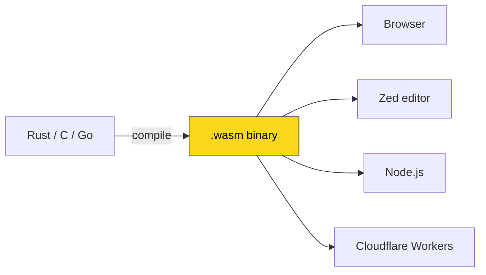
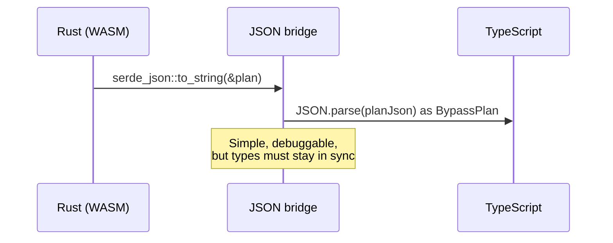
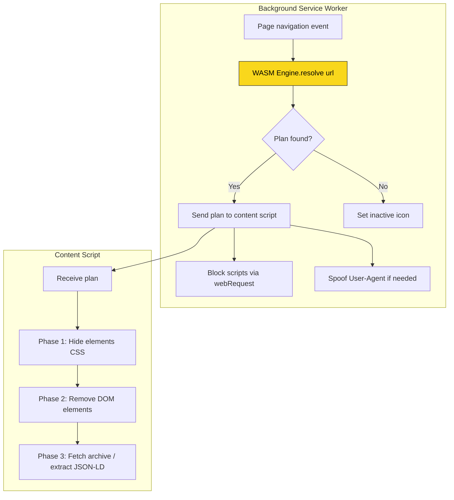
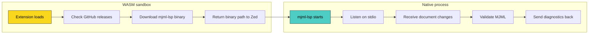
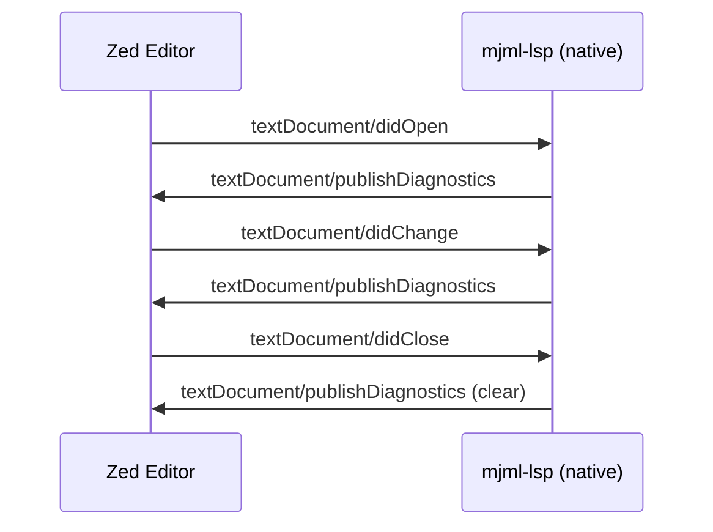
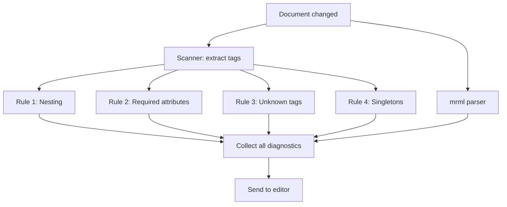
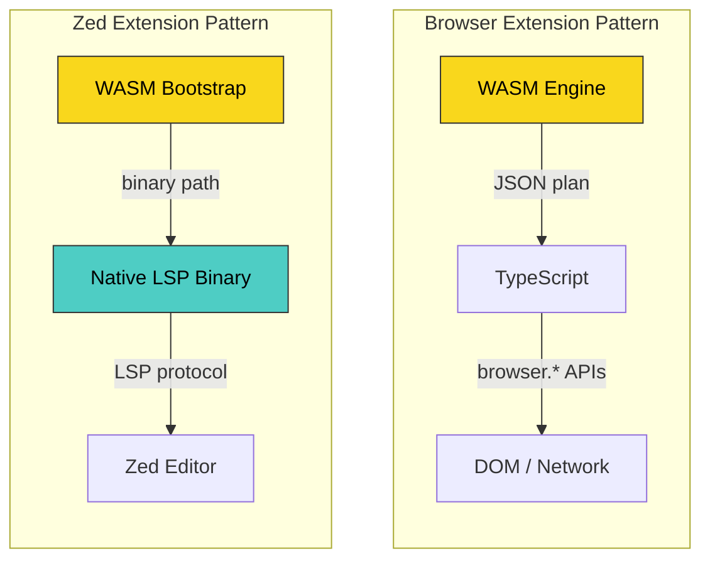

## What is WebAssembly?

WebAssembly (WASM) is a binary instruction format designed as a portable compilation target for programming languages. Think of it as a compact, fast, sandboxed virtual machine that runs alongside JavaScript in the browser — and increasingly, outside it too.

The key properties that make WASM interesting:

- Fast: near-native execution speed, with predictable performance
- Safe: runs in a sandboxed memory space, isolated from the host
- Portable: the same `.wasm` binary runs on any platform with a WASM runtime
- Language-agnostic: you can compile Rust, C, C++, Go, and many other languages to WASM



What makes WASM particularly compelling is the safety guarantee: since it runs in a sandbox, a host application can load and execute third-party WASM modules without worrying about them accessing the file system, network, or memory outside their allocated space. This is exactly why both browser extensions and code editors have adopted it as their extension format.

## How I first heard about it

I first came across WebAssembly through Stu, a colleague, who shared a message about it on Slack:

> On December 5, The World Wide Web Consortium (W3C) announced that the WebAssembly Core Specification is now an official web standard. This makes WebAssembly the fourth language for the web, following HTML, CSS, and JavaScript.

He published on 26th December 2019

It planted the seed, but at the time it felt like something reserved for game engines and image processing libraries — not the sort of thing I would use day to day.

## My first encounter: a small language model

My first real experience using WASM happened in an unexpected way. I was working on a project where we needed the browser to recognise images as part of a client’s Know Your Client (KYC) process. We used a third-party service, and my job was to connect our system to their API.

This was my first time using WASM in a real project. I also had to connect it to a third-party API and use a small built-in language model for image recognition. I learned a lot from this and realised how useful WASM can be in the browser.

It was eye-opening to see that a machine learning model could run entirely on the user's computer, without sending information to a server.

This taught me something important about WASM: it’s not just a faster version of JavaScript. WASM allows you to use powerful tools and libraries from other languages, such as Rust, C, and Python, in places that previously supported only JavaScript. That’s why I chose Rust and WASM when I needed more advanced features in my browser extension.

## The TypeScript interface problem

When you compile Rust to WASM using [`wasm-bindgen`](https://wasm-bindgen.github.io/wasm-bindgen/), you get auto-generated TypeScript bindings. But there is a catch: the boundary between Rust and JavaScript is limited to simple types. You cannot pass a rich Rust struct directly to JavaScript. Instead, you serialise to JSON on the Rust side and deserialise on the JavaScript side.

This means you end up maintaining parallel type definitions:

Rust side (`plan.rs`):

```rust
#[derive(Serialize)]
pub struct BypassPlan {
    pub site_name: String,
    pub hide_selectors: Vec<String>,
    pub block_script_patterns: Vec<String>,
    pub spoof_useragent: Option<String>,
    pub fetch_archive: Option<ArchivePlan>,
    // ...
}
```

TypeScript side (`types.ts`):

```typescript
export interface BypassPlan {
  site_name: string;
  hide_selectors: string[];
  block_script_patterns: string[];
  spoof_useragent: string | null;
  fetch_archive: ArchivePlan | null;
  // ...
}
```

The JSON bridge is simple and debuggable — you can inspect the data flowing between Rust and TypeScript in the browser console — but keeping these types in sync is a manual process.



## Stained Wall: a Firefox extension powered by WASM

As you most likely know, I am Venezuelan and access to the news is often blocked by websites or not reachable from my country. Since I fled, I normally screenshot news articles and share them with my people who are still there so they can stay informed.

So, some of the news outlets I follow have gone to a paid subscription model, and I can’t access them from my country either. That’s where Stained Wall comes in.

### The architecture

It is a Firefox Manifest V3 (MV3) browser extension. Its architecture follows a clear principle: Rust decides, TypeScript executes.

The Rust/WASM engine handles all the logic — matching URLs against site configurations, generating bypass plans, and deciding which scripts to block. TypeScript handles everything that requires browser APIs — DOM manipulation, request interception, and messaging between the background service worker and content scripts.



### Why WASM for a browser extension?

You might ask: why not just write the matching logic in TypeScript? Three reasons:

1. Safety: Rust's type system and borrow checker catch entire categories of bugs at compile time. The engine forbids `unsafe` code entirely (`#![forbid(unsafe_code)]`), so there are zero memory safety concerns in the WASM module.

2. Testability: The Rust engine can be tested natively with `cargo test`, without needing a browser environment. Unit tests for URL matching, plan generation, and script blocking run in milliseconds.

3. Separation of concerns: The engine knows nothing about browser APIs. It takes a URL string and returns a JSON plan. This makes it trivially easy to reason about: given this input, what output do I get?

### Features

The extension supports a rich set of bypass strategies, all declared in a `sites.json` configuration file:

| Strategy          | What it does                                                             |
| ----------------- | ------------------------------------------------------------------------ |
| `hide`            | Injects CSS to hide paywall overlays immediately, before the page paints |
| `remove`          | Deletes DOM elements after the page loads                                |
| `block_scripts`   | Intercepts and cancels network requests matching regex patterns          |
| `spoof_useragent` | Replaces the User-Agent header (e.g. to impersonate Googlebot)           |
| `archive`         | Fetches the article from an archive service and injects the content      |
| `json_ld`         | Extracts article text from embedded JSON-LD structured data              |
| `inject_css`      | Injects custom CSS rules to override paywall styling                     |

Each strategy is declarative — you configure it in JSON, and the Rust engine generates the appropriate plan:

```json
{
  "name": "A fictitious site",
  "domains": ["something.com"],
  "strategy": {
    "archive": {
      "paywall_selector": "teg-page-wall",
      "article_selector": "main"
    },
    "hide": ["div[class*=\"adComponent\"]", ".wall-overlay"]
  }
}
```

### The browser extension API

Working with the Firefox extension API in MV3 requires careful choreography. The WASM module must be loaded in the background service worker, but MV3's Content Security Policy restricts how you can do this. The key pieces:

1. Declare WASM as a web-accessible resource (`manifest.json`):

```json
{
  "web_accessible_resources": [
    {
      "resources": ["pkg/stained_wall_engine_bg.wasm"],
      "matches": ["<all_urls>"]
    }
  ]
}
```

2. Allow WASM evaluation in the CSP:

```json
{
  "content_security_policy": {
    "extension_pages": "script-src 'self' 'wasm-unsafe-eval'"
  }
}
```

3. Load the WASM module using `browser.runtime.getURL()`:

```typescript
const wasmUrl = browser.runtime.getURL('pkg/stained_wall_engine_bg.wasm');
await init({ module_or_path: wasmUrl });
const sitesJson = await fetch(browser.runtime.getURL('sites.json'));
engine = new Engine(await sitesJson.text());
```

One subtle challenge is timing. The content script might load before the WASM engine has finished initialising in the background script. To handle this, Stained Wall uses a dual messaging pattern:

- Push: the background script sends the plan to the content script as soon as the engine resolves it
- Pull: the content script also requests the plan from the background script as a fallback

This ensures the plan reaches the content script regardless of initialisation order.

### Safe DOM operations

MV3's strict CSP means you cannot use `element.innerHTML` to inject content. All DOM operations in Stained Wall use `DOMParser` instead:

```typescript
// Safe alternative using DOMParser
const parser = new DOMParser();
const doc = parser.parseFromString(html, 'text/html');
while (doc.body.firstChild) {
  element.appendChild(doc.body.firstChild);
}
```

This pattern is more verbose but eliminates any risk of XSS and keeps the extension compliant with MV3's security model.

## Zed MJML: a code editor extension powered by WASM

### What is MJML?

[MJML](https://mjml.io/) is an email markup language that compiles to responsive HTML email. If you have ever tried to write HTML emails by hand — with their nested tables, inline styles, and inconsistent client support — you will appreciate why MJML exists. It provides a component-based syntax that handles the responsive email nightmare for you:

```html
<mjml>
  <mj-body>
    <mj-section>
      <mj-column>
        <mj-text>Hello world</mj-text>
        <mj-button href="https://example.com">Click me</mj-button>
      </mj-column>
    </mj-section>
  </mj-body>
</mjml>
```

I used to do this by hand in Ye Old days (2015).

### Why build a Zed extension?

[Zed](https://zed.dev/) is a modern code editor built in Rust, designed for speed and collaboration. Its extension system uses WASM as the plugin format — every extension is a compiled `.wasm` module that runs in a sandbox. This is where things get interesting and where the contrast with browser extensions becomes clear.

### The Zed extension API

Zed extensions implement a Rust trait that gets compiled to WASM:

```rust
use zed_extension_api as zed;

struct MjmlExtension {
    cached_binary_path: Option<String>,
}

impl zed::Extension for MjmlExtension {
    fn new() -> Self {
        MjmlExtension { cached_binary_path: None }
    }

    fn language_server_command(
        &mut self,
        _language_server_id: &zed::LanguageServerId,
        worktree: &zed::Worktree,
    ) -> Result<zed::Command> {
        // Download and return path to mjml-lsp binary
    }
}

zed::register_extension!(MjmlExtension);
```

The API provides a set of platform functions that extensions can call:

- `zed::current_platform()` — detect OS and architecture
- `zed::latest_github_release()` — fetch release metadata from GitHub
- `zed::download_file()` — download files with gzip decompression
- `zed::make_file_executable()` — set the executable bit
- `zed::set_language_server_installation_status()` — show progress in the UI

### The Zed pattern

Here is where WASM usage fundamentally differs from Stained Wall. In the browser extension, WASM runs the core logic. In the Zed extension, WASM is just a bootstrap layer. The extension’s sole job is to:

1. Check for the latest release of the `mjml-lsp` binary on GitHub.
2. Download the correct platform-specific binary (macOS arm64, macOS x86_64, Linux x86_64)
3. Make it executable
4. Tell Zed where to find it.

All the actual work — parsing MJML, validating documents, reporting diagnostics — happens in a native Rust binary that communicates with Zed over the [Language Server Protocol (LSP)](https://microsoft.github.io/language-server-protocol/).



### What is a language server?

A language server is a separate process that provides language-specific features to an editor: diagnostics (errors and warnings), autocompletion, go-to-definition, hover information, and more. The Language Server Protocol (LSP) standardises the communication between the editor and the server, so the same language server can work with VS Code, Zed, Neovim, or any editor that supports LSP.

The `mjml-lsp`, server communicates over stdio (standard input/output) using JSON-RPC messages:



### Tree-sitter: syntax without a custom grammar

One of the elegant decisions in the MJML extension is reusing the existing [tree-sitter-html](https://github.com/tree-sitter/tree-sitter-html) grammar. Since MJML is syntactically identical to HTML — just with custom tag names like `<mj-section>` and `<mj-text>` — the HTML parser handles it perfectly.

Tree-sitter is an incremental parsing library that generates a concrete syntax tree from source code. Zed uses it for syntax highlighting, bracket matching, indentation, and code folding. Instead of writing a custom MJML grammar, the extension uses query files (`.scm` files written in S-expressions) to teach Zed how to treat MJML-specific tags:

```scheme
;; highlights.scm — Structural tags highlighted as keywords
((tag_name) @keyword
  (#match? @keyword "^(mjml|mj-head|mj-body|mj-include)$"))

;; Head configuration tags highlighted as types
((tag_name) @type
  (#match? @type "^(mj-attributes|mj-style|mj-font)$"))

;; CSS injection inside <mj-style> tags
(element
  (start_tag (tag_name) @_tag (#eq? @_tag "mj-style"))
  (text) @injection.content
  (#set! injection.language "css"))
```

This approach means the extension gets syntax highlighting, bracket matching, auto-indentation, and CSS injection inside `<mj-style>` blocks — all without writing a single line of grammar code.

### The validation pipeline

The language server uses a two-pass validation strategy:

Pass 1 — Custom semantic validation: A lightweight byte-level scanner extracts tags and their relationships, then four rules check against the MJML specification:

1. Nesting validation: `<mj-text>` must be inside `<mj-column>` or `<mj-hero>`, not directly in `<mj-section>`
2. Required attributes: `<mj-image>` must have a `src` attribute
3. Unknown tag detection: Warns about typos like `<mj-seciton>` and suggests `<mj-section>` (using Levenshtein distance)
4. Singleton enforcement: Only one `<mj-head>` and one `<mj-body>` per document

Pass 2 — Structural validation: The [`mrml`](https://crates.io/crates/mrml) crate (a Rust MJML parser) performs deep structural validation, catching issues like unclosed tags and malformed XML.



Both passes run independently, and all diagnostics are reported together, giving the developer a complete picture of issues in their MJML document.

## Differences between Zed and browser extension APIs

Having built WASM extensions for both platforms, the differences are striking:

| Aspect             | Firefox Extension (MV3)                           | Zed Extension                                   |
| ------------------ | ------------------------------------------------- | ----------------------------------------------- |
| WASM role          | Core logic engine (URL matching, plan generation) | Bootstrap only (binary download and management) |
| Runtime            | Browser's WASM runtime (SpiderMonkey)             | Zed's embedded WASM runtime (Wasmtime)          |
| Host APIs          | Browser APIs via JavaScript (`browser.*`)         | Zed APIs via `zed_extension_api` crate          |
| Communication      | JSON over message passing                         | Language Server Protocol over stdio             |
| Build target       | `wasm32-unknown-unknown` via `wasm-pack`          | `wasm32-wasip1` via `cargo build`               |
| Security model     | CSP + `wasm-unsafe-eval`                          | WASI sandbox (no file system, no network)       |
| Extension language | Rust (WASM) + TypeScript (browser APIs)           | Pure Rust (WASM + native binary)                |
| Update mechanism   | Manual rebuild and reload                         | Zed extension marketplace + GitHub releases     |

The most significant difference is in what the WASM module actually does. In the browser extension, WASM is the brain — it makes decisions that drive the extension's behaviour. In the Zed extension, WASM is the hand — it performs a mechanical task (downloading a binary) and then steps aside.

This difference comes down to platform constraints:

- Browser extensions have access to rich JavaScript APIs but need WASM for performance and safety. The WASM module can do substantial work because the browser provides a full JavaScript runtime alongside it.

- Zed extensions run in a stricter WASI sandbox with limited capabilities. The WASM module can call Zed's API functions but cannot spawn processes, open network connections, or access the file system directly. For anything beyond simple logic, the pattern is to delegate to a native binary via LSP.



## What I learned

Building these two projects taught me that WASM is not a single thing — it is a spectrum of integration patterns. At one end, you have heavy WASM modules that perform substantial computation. At the other end, you have thin WASM wrappers that exist purely to satisfy a platform's extension format (like the Zed MJML extension).

The key is understanding what the host platform offers and what it constrains:

- If the host gives you rich APIs and a JavaScript runtime, lean into WASM for the logic that benefits from Rust's safety and performance.

- If the host gives you a strict sandbox with limited capabilities, use WASM as a bridge to native code where the real work happens.

WASM's portability promise is real, but it is not about running the same code everywhere in the same way. It is about having a safe, sandboxed format that platforms can adopt as their extension mechanism — and then building the right architecture around it.

If you have not tried WASM yet, I would encourage you to start small. Pick a piece of logic that is well-defined and self-contained — a validator, a parser, a matcher — compile it to WASM, and see how it feels. You might be surprised at how natural it is to have Rust and TypeScript working side by side.

---

_It is an open source project: [zed-mjml](https://github.com/pataruco/zed-mjml)._
